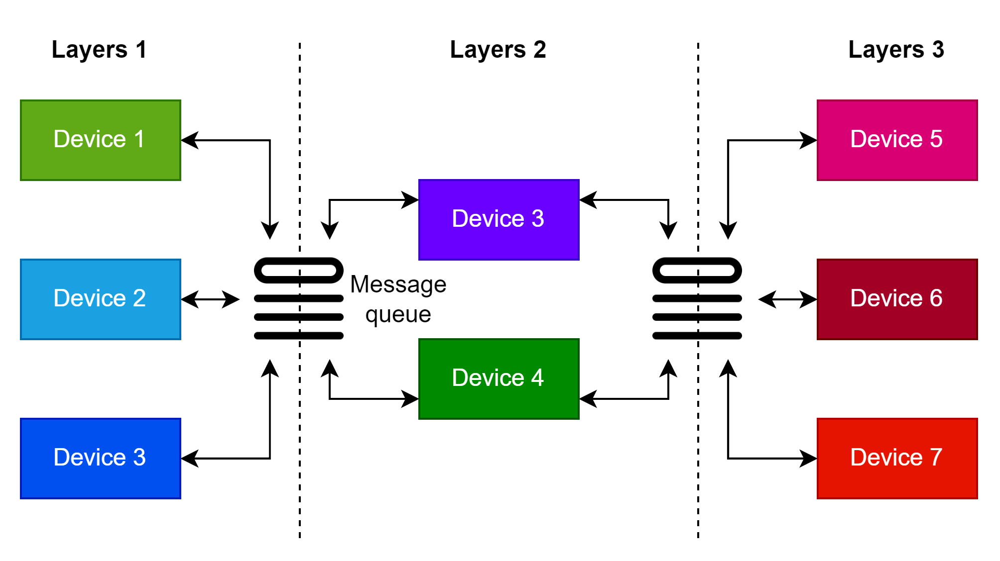

# Split Learning

## Mô hình triển khai



## Yêu cầu các gói
```
torch
torchvision
pika
tqdm
```

Dựng một RabbitMQ server để giao tiếp các bản tin qua môi trường mạng

```yaml
version: '3'
services:
  rabbitmq:
    image: rabbitmq:management
    container_name: rabbitmq
    ports:
      - "5672:5672"   # RabbitMQ main port
      - "15672:15672" # Management UI
    environment:
      RABBITMQ_DEFAULT_USER: user
      RABBITMQ_DEFAULT_PASS: password
    volumes:
      - rabbitmq_data:/var/lib/rabbitmq
volumes:
  rabbitmq_data:
    driver: local
```

## Cách chạy

### Server
```commandline
python server.py --topo 3 2 1
```
Cụ thể, layer 1 có 3 client, layer 2 có 2 client, layer 3 có 1 client

### Client

Trong cùng một layer, các client không nên khai trùng ID của nhau. Nếu khai trùng, hiệu quả học có thể bị ảnh hưởng.

#### Layer 1
```commandline
python client_layers_1.py --id 1
```

```commandline
python client_layers_1.py --id 2
```

```commandline
python client_layers_1.py --id 3
```

#### Layer 2
```commandline
python client_layers_2.py --id 1
```
```commandline
python client_layers_2.py --id 2
```

## Cấu hình

Trong mỗi file client có thể cấu hình tham số:
- Địa chỉ RabbitMQ server
- Thông tin đăng nhập như username, password
- ID của layer (Đánh số thứ tự lần lượt từ 1)

## File parameters

Trên server, các file `*.pth` được lưu trong đường dẫn chạy chính của code `server.py` sau khi training xong 1 round.

Nếu tồn tại file `*.pth`, server sẽ đọc file và truyền parameters tới các client. Ngược lại, nếu không tồn tại file `*.pth`, model DNN được tạo với các parameters mới. Vì vậy nếu muốn clear quá trình training trước, cần xóa các file `*.pth`

Quá trình đang phát triển sản phẩm ...
